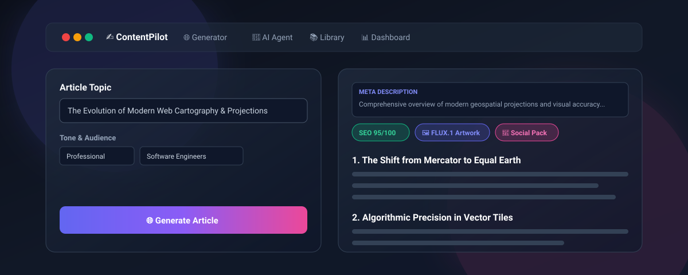
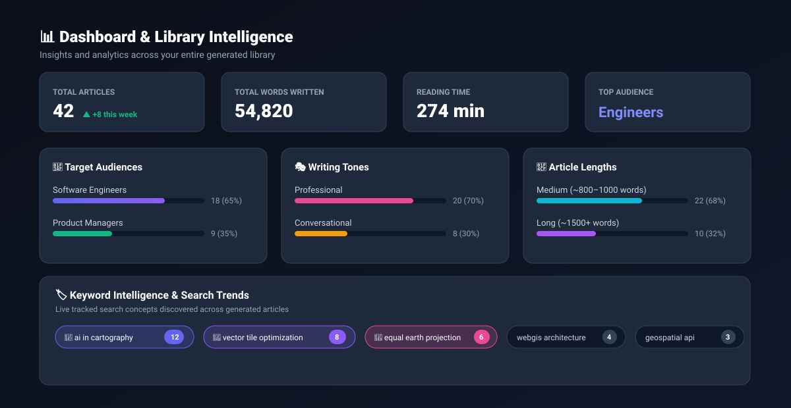
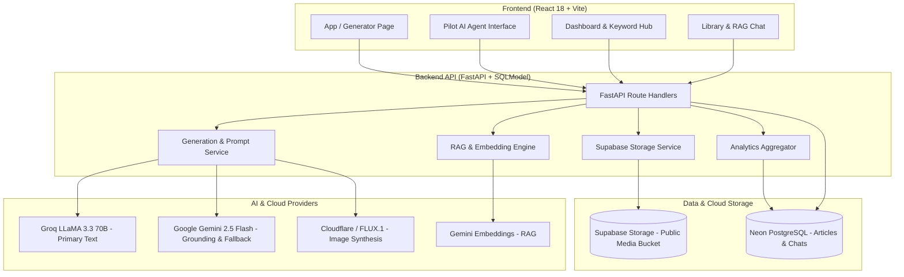

# ✍️ ContentPilot

> **Autonomous AI-Powered Content Creation & Editorial Intelligence Platform**  
> Generate web-grounded, SEO-optimized articles, refine them with an autonomous agent, query your library using semantic RAG, analyze content trends, and repurpose across platforms with one click.

---

<p align="center">
  
</p>

<p align="center">
  
  
  
  
  
  
  
</p>

---

## 🌟 Overview

**ContentPilot** is an end-to-end editorial platform that transforms rough concepts into comprehensive, publication-ready articles. It bridges live web research, multi-turn AI agent editing, semantic library search (RAG), dynamic AI artwork generation, and deep analytics into a cohesive, responsive workflow.

---

## 🚀 Key Modules & Capabilities

### 1. 🌐 Web-Grounded Content Generation
* **Live Search Grounding**: Connects real-time web search with LLMs (Groq compound systems & Google Gemini grounding) for fact-based, accurate writing.
* **Outline-First Workflow**: Interactively propose, reorder, expand, or customize section outlines before generating full content.
* **Granular Editorial Controls**: Tailor tone (*Professional, Conversational, Technical, Academic, Persuasive*), length (*Short, Medium, Long*), and target audience profiles.
* **Section-by-Section Rewriting**: Refine individual subsections without regenerating the entire document.

---

### 2. 🤖 Pilot — Autonomous AI Editorial Agent
* **Multi-Step Tool Orchestration**: Plans and executes multi-phase tasks from natural language prompts with real-time per-step status execution cards.
* **Autonomous Toolkit**:
  * ✍️ **Intelligent Editing**: Applies surgical stylistic and factual revisions.
  * 🎯 **SEO Optimization**: Computes Flesch readability, keyword density, and heading hierarchy, then applies one-click structural fixes.
  * 🔍 **Competitor SERP Analysis**: Scans search competitor structures to identify content gaps and missing subtopics.
  * 🌐 **Multilingual Translation**: Preserves formatting and nuances across any target language.
  * 🖼️ **Media Synthesis**: Coordinates cover art and section image creation.
* **Dual Chat Architecture**:
  * **Article Chat**: Context-scoped task assistant for current draft editing.
  * **Library Chat (RAG)**: Cross-library question-answering powered by vector embeddings and citation links.

---

### 3. 🎨 Visual Media & Image Engine
* **Context-Aware Visual Generation**: Produces tailored cover art and per-section illustrations using FLUX.1 / Cloudflare Workers AI / Pollinations.
* **Persistent Cloud Storage**: Automatically stores media in Supabase Storage buckets, ensuring assets survive redeployments and render reliably.
* **Real-Time Visual Feedback**: Live animated generation banners and responsive loading indicators keep users informed throughout the generation lifecycle.

---

### 4. 📊 Keyword Intelligence & Dashboard Analytics
* **Balanced Content Distribution Matrix**: 3-column breakdown visualizing audience distribution, tone preferences, and length distributions without layout distortion.
* **Dual-Mode Keyword Hub**:
  * 🏷️ **Tag Cloud View**: Compact, interactive chips with medal highlights (🥇, 🥈, 🥉) for top-performing topics.
  * 📊 **Ranked Leaderboard**: Complete ranking table with percentage shares, visual frequency progress bars, and one-click copy actions.
* **Productivity Metrics**: Tracks 30-day activity timelines, word counts, reading time estimates, and week-over-week trends.

<p align="center">
  
</p>

---

### 5. 🔁 Omnichannel Repurposing & Multi-Format Export
* **X (Twitter) Threads**: Converts long-form articles into high-engagement thread posts with hook lines and structured points.
* **LinkedIn Thought-Leadership**: Formats ready-to-paste posts optimized for professional networks.
* **Email Newsletters**: Generates structured newsletters complete with subject lines, previews, highlight bullets, and call-to-actions.
* **FAQ Accordions**: Automatically extracts question-and-answer pairs for search snippet optimization.
* **Multi-Format Export**: One-click downloads as `.md`, `.html`, or printable `.pdf`.

---

### 6. 🎨 Dynamic Theme Customization
* 8 handcrafted visual themes:
  * 🌌 **Midnight** (Sleek Dark Glassmorphism)
  * 🌊 **Ocean** (Deep Teal/Cyan)
  * 🌲 **Forest** (Emerald Green)
  * 🌇 **Sunset** (Vibrant Amber/Orange)
  * 🌸 **Rose** (Modern Pink/Fuchsia)
  * ❄️ **Nord** (Arctic Slate Blue)
  * ⚪ **Daylight** (Clean Minimal Light)
  * 📓 **Mono** (High-Contrast Monochrome)

---

## 🏛️ System Architecture



---

## 📦 Project Structure

```
ContentPilot/
├── backend/
│   ├── app/
│   │   ├── main.py              # FastAPI application entry & route bindings
│   │   ├── config.py            # Application configuration & environment mappings
│   │   ├── db.py                # Database connection & SQLModel session engine
│   │   ├── models.py            # Database schemas (Article, ChatSession, Embedding)
│   │   ├── schemas.py           # Pydantic request & response models
│   │   ├── auth.py              # Authentication handler & token verification
│   │   ├── routers/
│   │   │   ├── articles.py      # Article lifecycle CRUD operations
│   │   │   ├── stats.py         # Dashboard analytics & distribution metrics
│   │   │   ├── library.py       # Semantic RAG library search & QA
│   │   │   ├── chat.py          # Multi-session chat persistence
│   │   │   └── notify.py        # Email digests & subscriptions
│   │   └── services/
│   │       ├── generator.py     # LLM orchestration, RAG embeddings, & agent planner
│   │       ├── storage.py       # Supabase image upload & public URL resolution
│   │       └── mailer.py        # Email dispatch service
│   └── requirements.txt
├── frontend/
│   ├── src/
│   │   ├── App.jsx              # Core Generator & Editor interface
│   │   ├── Layout.jsx           # Global navigation & theme switcher
│   │   ├── AuthGate.jsx         # User authentication gate & session context
│   │   ├── pages/
│   │   │   ├── Dashboard.jsx    # Metrics, 3-column distributions & Keyword Intelligence
│   │   │   ├── Agent.jsx        # Pilot AI Agent & Multi-Session workspace
│   │   │   └── Library.jsx      # Article repository & archive
│   │   ├── api.js               # Frontend API client
│   │   └── styles.css           # Design tokens, themes, & glassmorphism system
│   ├── index.html
│   ├── vite.config.js
│   └── package.json
└── assets/
    └── screenshots/             # Visual previews, diagrams, and media assets
```

---

## 📊 Core Data Entities

| Model | Description | Key Fields |
| :--- | :--- | :--- |
| **`Article`** | Core content records generated by users | `id`, `user_id`, `title`, `topic`, `markdown`, `cover_url`, `word_count`, `keywords`, `tone`, `length`, `audience` |
| **`ChatSession`** | Multi-turn AI Agent dialogues & session history | `id`, `user_id`, `article_id`, `mode` (*article / library*), `title`, `messages` |
| **`Embedding`** | Precomputed semantic vectors for RAG querying | `id`, `article_id`, `chunk_index`, `vector`, `updated_at` |
| **`Subscription`** | Digest delivery preferences & schedules | `id`, `user_id`, `email`, `enabled`, `send_day`, `send_hour`, `timezone` |

---

<p align="center">
  <b>ContentPilot</b> — Crafted for creators, engineers, and digital publishers.
</p>
